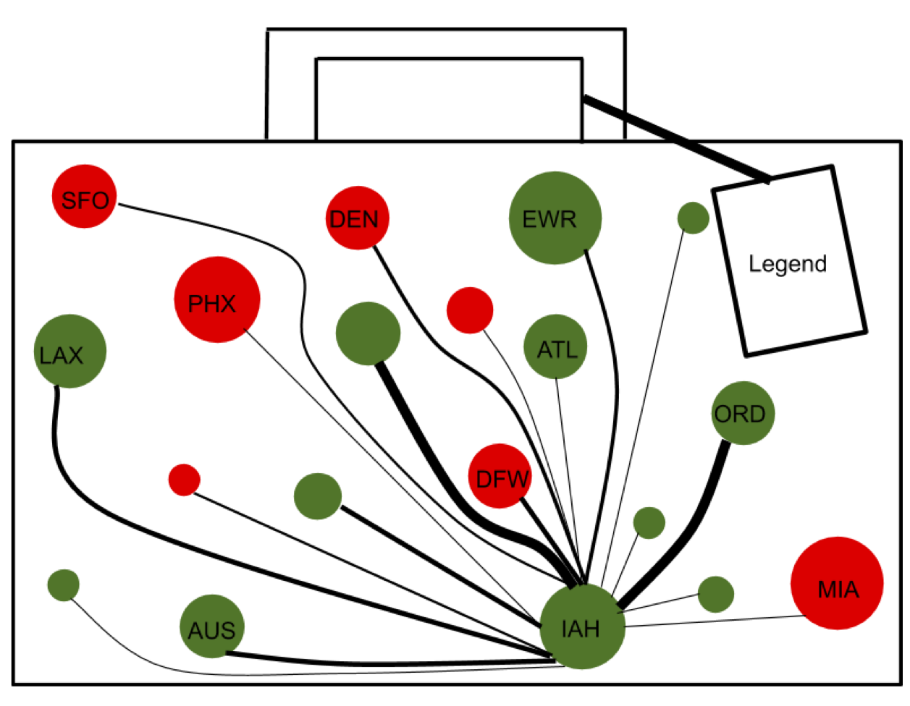

#### Group Members 
Melinda Ding (mjd4), Henry Creamer (hmc5), Caleigh Page (cap9), Aaryan Jadhav (aj52), Cole Morgan (cmm16)

```{r, echo=TRUE, warning=FALSE, message=FALSE}
library(RSQLite)
library(ggplot2)
library(tidyverse)
library(grid)
library(gridBase)
library(gridExtra)
library(dplyr)
library(prophet)

dcon <- dbConnect(SQLite(), dbname = "./group10.db")
dbListTables(dcon)
```

## Task 1: Combine related plots into one visualization
For the first task, we decided to create a plot of the number of flights going to the top 20 destinations from Houston, Austin, Dallas DFW and Dallas DAl. 

Query the airports with the most outgoing flights.
```{r, echo=TRUE}
res <- dbSendQuery(conn = dcon, "
SELECT ORIGIN, count(*) as c
FROM flights
GROUP BY ORIGIN 
ORDER BY c DESC")
topOutgoing <- dbFetch(res, -1)
txairports <- c("ABI", "AUS", "CRP", "DFW", "DAL", "ELP", "GRK", "IAH", "HOU", "LBB", "MAF", "SAT", "ACT", "SPS")
topOutTexas <- topOutgoing$ORIGIN[topOutgoing$ORIGIN %in% txairports]
top4Texas <- topOutTexas[1:4]
top4Texas
dbClearResult(res)
```

Queries all of the flight data in for each of the top 4 Texas airports. Each of these 4 dataframes will hold all of the flight data for IAH, AUS, DFW, DAL respectively.
```{r, echo=TRUE, warning=FALSE, message=FALSE}
res <- dbSendQuery(conn = dcon, "
SELECT *
FROM flights
WHERE ORIGIN = 'IAH';")
iahFlights <- dbFetch(res, -1)
dbClearResult(res)

res <- dbSendQuery(conn = dcon, "
SELECT *
FROM flights
WHERE ORIGIN = 'AUS';")
ausflights <- dbFetch(res, -1)
dbClearResult(res)

res <- dbSendQuery(conn = dcon, "
SELECT *
FROM flights
WHERE ORIGIN = 'DFW';")
dfwFlights <- dbFetch(res, -1)
dbClearResult(res)

res <- dbSendQuery(conn = dcon, "
SELECT *
FROM flights
WHERE ORIGIN = 'DAL';")
dalFlights <- dbFetch(res, -1)
dbClearResult(res)
```

Finds and plots top 20 destinations from the four airports in Texas with the most outgoing flights.
```{r, echo=TRUE, warning=FALSE, message=FALSE}
# IAH
n <- length(sort(table(iahFlights$DEST)))
top20 <- data.frame(sort(table(iahFlights$DEST))[(n -20):n]) 
top20names <- as.vector(top20$Var1)
top20data <- iahFlights[iahFlights$DEST %in% top20names, ]
p1 <- ggplot() + 
  geom_bar(data=top20data, aes(DEST), color="black", fill="lightblue") + 
  theme(axis.text.x=element_text(angle=90, hjust=1, size=9)) +
  ylab("Number of Flights") + 
  xlab("Destination") +
  ggtitle("Top 20 Destinations from IAH")

# AUS
n <- length(sort(table(ausflights$DEST)))
top20 <- data.frame(sort(table(ausflights$DEST))[(n -20):n]) 
top20names <- as.vector(top20$Var1)
top20data <- ausflights[ausflights$DEST %in% top20names, ]
p2 <- ggplot() + 
  geom_bar(data=top20data, aes(DEST), color="black", fill="pink") + 
  theme(axis.text.x=element_text(angle=90, hjust=1, size=9)) +
  ylab("Number of Flights") + 
  xlab("Destination") +
  ggtitle("Top 20 Destinations from AUS")

# DFW
n <- length(sort(table(dfwFlights$DEST)))
top20 <- data.frame(sort(table(dfwFlights$DEST))[(n -20):n]) 
top20names <- as.vector(top20$Var1)
top20data <- dfwFlights[dfwFlights$DEST %in% top20names, ]
p3 <- ggplot() + 
  geom_bar(data=top20data, aes(DEST), color="black", fill="lightgreen") + 
  theme(axis.text.x=element_text(angle=90, hjust=1, size=9)) +
  ylab("Number of Flights") + 
  xlab("Destination") +
  ggtitle("Top 20 Destinations from DFW")

# DAL
n <- length(sort(table(dalFlights$DEST)))
top20 <- data.frame(sort(table(dalFlights$DEST))[(n -20):n]) 
top20names <- as.vector(top20$Var1)
top20data <- dalFlights[dalFlights$DEST %in% top20names, ]
p4 <- ggplot() + 
  geom_bar(data=top20data, aes(DEST), color="black", fill="purple") + 
  theme(axis.text.x=element_text(angle=90, hjust=1, size=9)) +
  ylab("Number of Flights") + 
  xlab("Destination") +
  ggtitle("Top 20 Destinations from DAL")

grid.arrange(p1, p2, p3, p4, nrow = 2)
```


## Task 2: Embed other plots into a plot with empty space 
For this task, we decided to display time series analysis on our flight data. We first calculated the number of flights per month out of IAH and realized there is a lot of whitespace around this plot. We then added a plot of the number of flights per day out of IAH and a plot of the number of flights per day of week out of IAH to the white spaces in the plot of the number of flights per month out of IAH. 

```{r, echo=TRUE,warning=FALSE, message=FALSE}
res <- dbSendQuery(conn=dcon, "
SELECT ORIGIN, MONTH, DAY_OF_MONTH, count(*) as count
FROM flights 
where ORIGIN == 'IAH'
group by MONTH, DAY_OF_MONTH;
")
df4b <- dbFetch(res, -1)
dbClearResult(res)
head(df4b)
```

```{r, echo=TRUE, message = FALSE, error = FALSE}
times <- as.POSIXct(24*3600 * 0:364, origin = '2018-01-01', tz = "GMT")
df <- data.frame("ds" = times, "y" = df4b$count)
m <- prophet(df)
future <- make_future_dataframe(m, periods = 20)
forecast <- predict(m, future)

df_for_plotting <- function(m, fcst) {
  # Make sure there is no y in fcst
  fcst$y <- NULL
  df <- m$history %>%
    dplyr::select(ds, y) %>%
    dplyr::full_join(fcst, by = "ds") %>%
    dplyr::arrange(ds)
  return(df)
}

seasonality_plot_df <- function(m, ds) {
  df_list <- list(ds = ds, cap = 1, floor = 0)
  for (name in names(m$extra_regressors)) {
    df_list[[name]] <- 0
  }
  # Activate all conditional seasonality columns
  for (name in names(m$seasonalities)) {
    condition.name = m$seasonalities[[name]]$condition.name
    if (!is.null(condition.name)) {
      df_list[[condition.name]] <- TRUE
    }
  }
  df <- as.data.frame(df_list)
  df <- setup_dataframe(m, df)$df
  return(df)
}
```

```{r, echo=TRUE, message = FALSE, error = FALSE}
##### WEEKLY PLOT #####
plot_weekly <- function(m, uncertainty = TRUE, weekly_start = 0, 
                        name = 'weekly') {
  # Compute weekly seasonality for a Sun-Sat sequence of dates.
  days <- seq(set_date('2017-01-01'), by='d', length.out=7) + as.difftime(
    weekly_start, units = "days")
  df.w <- seasonality_plot_df(m, days)
  seas <- predict_seasonal_components(m, df.w)
  seas$dow <- factor(weekdays(df.w$ds), levels=weekdays(df.w$ds))

  gg.weekly <- ggplot2::ggplot(
      seas, ggplot2::aes_string(x = 'dow', y = name, group = 1)) +
    ggplot2::theme(axis.text.x = element_text(angle=90, size = 5), 
                   title = element_text(size=6)) +
    ggplot2::ggtitle("Number of Flights per Day of Week") +
    ggplot2::scale_x_discrete(labels=c("Sunday" = "Sn", "Monday" = "M", 
                                       "Tuesday" = "T", "Wednesday" = "W", 
                                       "Thursday" = "Th", "Friday" = "F", 
                                       "Saturday" = "St")) +
    ggplot2::geom_line(color = "#0072B2", na.rm = TRUE) +
    ggplot2::labs(x = "Day of week")
  if (uncertainty && m$uncertainty.samples) {
    gg.weekly <- gg.weekly +
      ggplot2::geom_ribbon(ggplot2::aes_string(ymin = paste0(name, '_lower'),
                                               ymax = paste0(name, '_upper')),
                           alpha = 0.2,
                           fill = "#0072B2",
                           na.rm = TRUE)
  }
  if (m$seasonalities[[name]]$mode == 'multiplicative') {
    gg.weekly <- (
      gg.weekly + ggplot2::scale_y_continuous(labels = scales::percent)
    )
  }
  return(gg.weekly)
}

df <- df_for_plotting(m, forecast)
``` 

```{r, echo=TRUE, message = FALSE, error = FALSE}
##### DAILY PLOT #####
plot.prophet <- function(x, fcst, uncertainty = TRUE, plot_cap = TRUE,
                         xlabel = 'ds', ylabel = 'y', ...) {
  df <- df_for_plotting(x, fcst)
  gg <- ggplot2::ggplot(df, ggplot2::aes(x = ds, y = y)) +
    ggplot2::labs(x = xlabel, y = ylabel) +
    ggplot2::labs(x = "Day of Year") + 
    ggplot2::ggtitle("Number of Flights per Day") + 
    ggplot2::theme(title=element_text(size=8)) +
  if (exists('cap', where = df) && plot_cap) {
    gg <- gg + ggplot2::geom_line(
      ggplot2::aes(y = cap), linetype = 'dashed', na.rm = TRUE)
  }
  if (x$logistic.floor && exists('floor', where = df) && plot_cap) {
    gg <- gg + ggplot2::geom_line(
      ggplot2::aes(y = floor), linetype = 'dashed', na.rm = TRUE)
  }
  if (uncertainty && x$uncertainty.samples && exists('yhat_lower', where = df)) {
    gg <- gg +
      ggplot2::geom_ribbon(ggplot2::aes(ymin = yhat_lower, ymax = yhat_upper),
                           alpha = 0.2,
                           fill = "#0072B2",
                           na.rm = TRUE)
  }
  gg <- gg +
    ggplot2::geom_point(na.rm=TRUE) +
    ggplot2::geom_line(ggplot2::aes(y = yhat), color = "#0072B2",
                       na.rm = TRUE) +
    ggplot2::theme(aspect.ratio = 3 / 5)
  return(gg)
}

```

```{r, echo=TRUE, message = FALSE, error = FALSE}
##### MONTHLY PLOT #####
plot_forecast_component <- function(
  m, fcst, name, uncertainty = TRUE, plot_cap = FALSE
) {
  gg.comp <- ggplot2::ggplot(
      fcst, ggplot2::aes_string(x = 'ds', y = name, group = 1)) +
    ggplot2::geom_line(color = "#0072B2", na.rm = TRUE)  +
    ggplot2::ggtitle("Number of Flights per Month out of IAH") +
    ggplot2::labs(x = "Month")
  if (exists('cap', where = fcst) && plot_cap) {
    gg.comp <- gg.comp + ggplot2::geom_line(
      ggplot2::aes(y = cap), linetype = 'dashed', na.rm = TRUE)
  }
  if (exists('floor', where = fcst) && plot_cap) {
    gg.comp <- gg.comp + ggplot2::geom_line(
      ggplot2::aes(y = floor), linetype = 'dashed', na.rm = TRUE)
  }
  if (uncertainty && m$uncertainty.samples) {
    gg.comp <- gg.comp +
      ggplot2::geom_ribbon(
        ggplot2::aes_string(
          ymin = paste0(name, '_lower'), ymax = paste0(name, '_upper')
        ),
        alpha = 0.2,
        fill = "#0072B2",
        na.rm = TRUE)
  }
  if (name %in% m$component.modes$multiplicative) {
    gg.comp <- gg.comp + ggplot2::scale_y_continuous(labels = scales::percent)
  }
  return(gg.comp)
}
```

```{r, echo=TRUE, message = FALSE, error = FALSE}
set_date <- function(ds = NULL, tz = "GMT") {
  if (length(ds) == 0) {
    return(NULL)
  }

  if (is.factor(ds)) {
    ds <- as.character(ds)
  }

  if (min(nchar(ds), na.rm=TRUE) < 12) {
    ds <- as.POSIXct(ds, format = "%Y-%m-%d", tz = tz)
  } else {
    ds <- as.POSIXct(ds, format = "%Y-%m-%d %H:%M:%S", tz = tz)
  }
  attr(ds, "tzone") <- tz
  return(ds)
}

setup_dataframe <- function(m, df, initialize_scales = FALSE) {
  if (exists('y', where=df)) {
    df$y <- as.numeric(df$y)
  }
  if (any(is.infinite(df$y))) {
    stop("Found infinity in column y.")
  }
  df$ds <- set_date(df$ds)
  if (anyNA(df$ds)) {
    stop(paste('Unable to parse date format in column ds. Convert to date ',
               'format (%Y-%m-%d or %Y-%m-%d %H:%M:%S) and check that there',
               'are no NAs.'))
  }
  for (name in names(m$extra_regressors)) {
    if (!(name %in% colnames(df))) {
      stop('Regressor "', name, '" missing from dataframe')
    }
    df[[name]] <- as.numeric(df[[name]])
    if (anyNA(df[[name]])) {
      stop('Found NaN in column ', name)
    }
  }
  for (name in names(m$seasonalities)) {
    condition.name = m$seasonalities[[name]]$condition.name
    if (!is.null(condition.name)) {
      if (!(condition.name %in% colnames(df))) {
        stop('Condition "', name, '" missing from dataframe')
      }
      if(!all(df[[condition.name]] %in% c(FALSE,TRUE))) {
        stop('Found non-boolean in column ', name)
      }
      df[[condition.name]] <- as.logical(df[[condition.name]])
    }
  }
  
  df <- df %>%
    dplyr::arrange(ds)

  m <- initialize_scales_fn(m, initialize_scales, df)

  if (m$logistic.floor) {
    if (!('floor' %in% colnames(df))) {
      stop("Expected column 'floor'.")
    }
  } else {
    df$floor <- 0
  }

  if (m$growth == 'logistic') {
    if (!(exists('cap', where=df))) {
      stop('Capacities must be supplied for logistic growth.')
    }
    if (any(df$cap <= df$floor)) {
      stop('cap must be greater than floor (which defaults to 0).')
    }
    df <- df %>%
      dplyr::mutate(cap_scaled = (cap - floor) / m$y.scale)
  }

  df$t <- time_diff(df$ds, m$start, "secs") / m$t.scale
  if (exists('y', where=df)) {
    df$y_scaled <- (df$y - df$floor) / m$y.scale
  }

  for (name in names(m$extra_regressors)) {
    props <- m$extra_regressors[[name]]
    df[[name]] <- (df[[name]] - props$mu) / props$std
  }
  return(list("m" = m, "df" = df))
}

initialize_scales_fn <- function(m, initialize_scales, df) {
  if (!initialize_scales) {
    return(m)
  }
  if ((m$growth == 'logistic') && ('floor' %in% colnames(df))) {
    m$logistic.floor <- TRUE
    floor <- df$floor
  } else {
    floor <- 0
  }
  m$y.scale <- max(abs(df$y - floor))
  if (m$y.scale == 0) {
    m$y.scale <- 1
  }
  m$start <- min(df$ds)
  m$t.scale <- time_diff(max(df$ds), m$start, "secs")
  for (name in names(m$extra_regressors)) {
    standardize <- m$extra_regressors[[name]]$standardize
    n.vals <- length(unique(df[[name]]))
    if (n.vals < 2) {
      standardize <- FALSE
    }
    if (standardize == 'auto') {
      if (n.vals == 2 && all(sort(unique(df[[name]])) == c(0, 1))) {
        # Don't standardize binary variables
        standardize <- FALSE
      } else {
        standardize <- TRUE
      }
    }
    if (standardize) {
      mu <- mean(df[[name]])
      std <- stats::sd(df[[name]])
      m$extra_regressors[[name]]$mu <- mu
      m$extra_regressors[[name]]$std <- std
    }
  }
  return(m)
}

time_diff <- function(ds1, ds2, units = "days") {
  return(as.numeric(difftime(ds1, ds2, units = units)))
}

predict_seasonal_components <- function(m, df) {
  out <- make_all_seasonality_features(m, df)
  m <- out$m
  seasonal.features <- out$seasonal.features
  component.cols <- out$component.cols
  if (m$uncertainty.samples){
    lower.p <- (1 - m$interval.width)/2
    upper.p <- (1 + m$interval.width)/2
  }

  X <- as.matrix(seasonal.features)
  component.predictions <- data.frame(matrix(ncol = 0, nrow = nrow(X)))
  for (component in colnames(component.cols)) {
    beta.c <- t(m$params$beta) * component.cols[[component]]

    comp <- X %*% beta.c
    if (component %in% m$component.modes$additive) {
      comp <- comp * m$y.scale
    }
    component.predictions[[component]] <- rowMeans(comp, na.rm = TRUE)
    if (m$uncertainty.samples){
      component.predictions[[paste0(component, '_lower')]] <- apply(
        comp, 1, stats::quantile, lower.p, na.rm = TRUE)
      component.predictions[[paste0(component, '_upper')]] <- apply(
        comp, 1, stats::quantile, upper.p, na.rm = TRUE)
    }
  }
  return(component.predictions)
}

make_seasonality_features <- function(dates, period, series.order, prefix) {
  features <- fourier_series(dates, period, series.order)
  colnames(features) <- paste(prefix, 1:ncol(features), sep = '_delim_')
  return(data.frame(features))
}

make_all_seasonality_features <- function(m, df) {
  seasonal.features <- data.frame(row.names = 1:nrow(df))
  prior.scales <- c()
  modes <- list(additive = c(), multiplicative = c())

  # Seasonality features
  for (name in names(m$seasonalities)) {
    props <- m$seasonalities[[name]]
    features <- make_seasonality_features(
      df$ds, props$period, props$fourier.order, name)
    if (!is.null(props$condition.name)) {
      features[!df[[props$condition.name]],] <- 0
    }
    seasonal.features <- cbind(seasonal.features, features)
    prior.scales <- c(prior.scales,
                      props$prior.scale * rep(1, ncol(features)))
    modes[[props$mode]] <- c(modes[[props$mode]], name)
  }

  # Holiday features
  holidays <- construct_holiday_dataframe(m, df$ds)
  if (nrow(holidays) > 0) {
    out <- make_holiday_features(m, df$ds, holidays)
    m <- out$m
    seasonal.features <- cbind(seasonal.features, out$holiday.features)
    prior.scales <- c(prior.scales, out$prior.scales)
    modes[[m$seasonality.mode]] <- c(
      modes[[m$seasonality.mode]], out$holiday.names
    )
  }

  # Additional regressors
  for (name in names(m$extra_regressors)) {
    props <- m$extra_regressors[[name]]
    seasonal.features[[name]] <- df[[name]]
    prior.scales <- c(prior.scales, props$prior.scale)
    modes[[props$mode]] <- c(modes[[props$mode]], name)
  }

  # Dummy to prevent empty X
  if (ncol(seasonal.features) == 0) {
    seasonal.features <- data.frame(zeros = rep(0, nrow(df)))
    prior.scales <- c(1.)
  }

  components.list <- regressor_column_matrix(m, seasonal.features, modes)
  return(list(m = m,
              seasonal.features = seasonal.features,
              prior.scales = prior.scales,
              component.cols = components.list$component.cols,
              modes = components.list$modes))
}

fourier_series <- function(dates, period, series.order) {
  t <- time_diff(dates, set_date('1970-01-01 00:00:00'))
  features <- matrix(0, length(t), 2 * series.order)
  for (i in 1:series.order) {
    x <- as.numeric(2 * i * pi * t / period)
    features[, i * 2 - 1] <- sin(x)
    features[, i * 2] <- cos(x)
  }
  return(features)
}

construct_holiday_dataframe <- function(m, dates) {
  all.holidays <- data.frame()
  if (!is.null(m$holidays)){
    all.holidays <- m$holidays
  }
  if (!is.null(m$country_holidays)) {
    year.list <- as.numeric(unique(format(dates, "%Y")))
    country.holidays.df <- make_holidays_df(year.list, m$country_holidays)
    all.holidays <- suppressWarnings(dplyr::bind_rows(all.holidays, country.holidays.df))
  }
  # If the model has already been fit with a certain set of holidays,
  # make sure we are using those same ones.
  if (!is.null(m$train.holiday.names)) {
    row.to.keep <- which(all.holidays$holiday %in% m$train.holiday.names)
    all.holidays <- all.holidays[row.to.keep,]
    holidays.to.add <- data.frame(
      holiday=setdiff(m$train.holiday.names, all.holidays$holiday)
    )
    all.holidays <- suppressWarnings(dplyr::bind_rows(all.holidays, holidays.to.add))
  }
  return(all.holidays)
}

regressor_column_matrix <- function(m, seasonal.features, modes) {
  components <- dplyr::data_frame(component = colnames(seasonal.features)) %>%
    dplyr::mutate(col = seq_len(dplyr::n())) %>%
    tidyr::separate(component, c('component', 'part'), sep = "_delim_",
                    extra = "merge", fill = "right") %>%
    dplyr::select(col, component)
  # Add total for holidays
  if(!is.null(m$train.holiday.names)){
    components <- add_group_component(
      components, 'holidays', unique(m$train.holiday.names))
  }
  # Add totals for additive and multiplicative components, and regressors
  for (mode in c('additive', 'multiplicative')) {
    components <- add_group_component(
      components, paste0(mode, '_terms'), modes[[mode]])
    regressors_by_mode <- c()
    for (name in names(m$extra_regressors)) {
      if (m$extra_regressors[[name]]$mode == mode) {
        regressors_by_mode <- c(regressors_by_mode, name)
      }
    }
    components <- add_group_component(
      components, paste0('extra_regressors_', mode), regressors_by_mode)
    # Add combination components to modes
    modes[[mode]] <- c(modes[[mode]], paste0(mode, '_terms'))
    modes[[mode]] <- c(modes[[mode]], paste0('extra_regressors_', mode))
  }
  # After all of the additive/multiplicative groups have been added,
  modes[[m$seasonality.mode]] <- c(modes[[m$seasonality.mode]], 'holidays')
  # Convert to a binary matrix
  component.cols <- as.data.frame.matrix(
    table(components$col, components$component)
  )
  component.cols <- (
    component.cols[order(as.numeric(row.names(component.cols))), ,
                   drop = FALSE]
  )
  # Add columns for additive and multiplicative terms, if missing
  for (name in c('additive_terms', 'multiplicative_terms')) {
    if (!(name %in% colnames(component.cols))) {
      component.cols[[name]] <- 0
    }
  }
  # Remove the placeholder
  components <- dplyr::filter(components, component != 'zeros')
  # Validation
  if (
    max(component.cols$additive_terms
    + component.cols$multiplicative_terms) > 1
  ) {
    stop('A bug occurred in seasonal components.')
  }
  # Compare to training, if set.
  if (!is.null(m$train.component.cols)) {
    component.cols <- component.cols[, colnames(m$train.component.cols)]
    if (!all(component.cols == m$train.component.cols)) {
      stop('A bug occurred in constructing regressors.')
    }
  }
  return(list(component.cols = component.cols, modes = modes))
}

add_group_component <- function(components, name, group) {
  new_comp <- components[(components$component %in% group), ]
  group_cols <- unique(new_comp$col)
  if (length(group_cols) > 0) {
    new_comp <- data.frame(col=group_cols, component=name)
    components <- rbind(components, new_comp)
  }
  return(components)
}
```

```{r, echo=TRUE, message = FALSE, error = FALSE}
daily <- plot.prophet(m, forecast)
monthly <- plot_forecast_component(m, forecast, "trend")
weekly <- plot_weekly(m)

grid.newpage()
vp1 <- viewport(x = 0, y = 0, width = 1.0, height = 1.0, just = c("left", "bottom"))
vp2 <- viewport(x = 0.45, y = 0.12, width = 0.55, height = 0.55, just = c("left", "bottom"))
vp3 <- viewport(x = 0.08, y = .62, width = 0.3, height = 0.28, just = c("left", "bottom"))
print(monthly, vp=vp1)
print(daily, vp=vp2)
print(weekly, vp=vp3)
```


## Task 3: Replace two ggplots and/or base plots with a version done from scratch using grid and its primitives. 

#### For this task, the first ggplot we decided to replace was a plot of the average delay times at DFW Airport per each day of the week. 

Make the database connection and fetch the average departure delay by day of the week using a SQL query.
```{r, echo=TRUE, message = FALSE, error = FALSE}
res <- dbSendQuery(conn = dcon, "
SELECT DAY_OF_WEEK, avg(DEP_DELAY)
FROM flights
WHERE ORIGIN = 'DFW' 
GROUP BY DAY_OF_WEEK;")
avg_delays <- dbFetch(res, -1)
dbClearResult(res)
```

Here we create the original plot using ggplot. We were curious how the delay time varies across the days of the week so we decided to plot the average delay time by day of the week.
```{r, echo=TRUE, message = FALSE, error = FALSE}
days <- c("Monday", "Tuesday", "Wednesday", "Thursday", "Friday", "Saturday", "Sunday")

avg_delays$DAY_OF_WEEK <- c("Monday", "Tuesday", "Wednesday", "Thursday", "Friday", "Saturday", "Sunday")
avg_delays$delayTime <- avg_delays$`avg(DEP_DELAY)`
avg_delays$DAY_OF_WEEK <- fct_relevel(avg_delays$DAY_OF_WEEK, "Monday", "Tuesday", "Wednesday", "Thursday", "Friday", "Saturday", "Sunday")

usingGg <- ggplot(avg_delays, aes(x = DAY_OF_WEEK, y = delayTime, order(days))) + geom_bar(stat = "identity", fill = "red", width = 0.5, color = "black") + 
  labs(x = "Day of the Week", y = "Average Delay Times (Minutes)", title = "Average Delay Times at DFW Airport by Day of the Week")
```

Function to recreate the plot using grid.
```{r, echo=TRUE, message = FALSE, error = FALSE}
my.grid.plot <- function(vals) {
  grid.newpage()
  grid.layout(1,2)
  top.vp <- viewport(width = 0.8, height = 0.8)
  pushViewport(top.vp)
  grid.xaxis(label = FALSE)
  grid.yaxis(label = FALSE)
  grid.text("Average Delay Times at DFW Airport by Day of the Week", x=.4,y=1.0)
  grid.text("Delay Time", x=unit(-0.05, "npc"),y=0.5, just = "bottom", rot = 90)
  grid.text("Day of the Week", x = 0.5, y = unit(-0.05, "npc"), just = "top")
  grid.rect(x = unit(0.2, "npc"), y = unit(0.4, "npc"), width = unit(0.2/3, "npc"),
            height = unit(vals[1]/15, "npc"),gp=gpar(col="black", fill = "red")) 
  grid.rect(x = unit(0.3, "npc"), y = unit(0.373, "npc"), width = unit(0.2/3, "npc"),
            height = unit(vals[2]/15, "npc"),gp=gpar(col="black", fill = "red")) 
  grid.rect(x = unit(0.4, "npc"), y = unit(0.316, "npc"), width = unit(0.2/3, "npc"),
            height = unit(vals[3]/15, "npc"),gp=gpar(col="black", fill = "red")) 
  grid.rect(x = unit(0.5, "npc"), y = unit(0.454, "npc"), width = unit(0.2/3, "npc"),
            height = unit(vals[4]/15, "npc"),gp=gpar(col="black", fill = "red")) 
  grid.rect(x = unit(0.6, "npc"), y = unit(0.462, "npc"), width = unit(0.2/3, "npc"),
            height = unit(vals[5]/15, "npc"),gp=gpar(col="black", fill = "red")) 
  grid.rect(x = unit(0.7, "npc"), y = unit(0.394, "npc"), width = unit(0.2/3, "npc"),
            height = unit(vals[6]/15, "npc"),gp=gpar(col="black", fill = "red")) 
  grid.rect(x = unit(0.8, "npc"), y = unit(0.364, "npc"), width = unit(0.2/3, "npc"),
            height = unit(vals[7]/15, "npc"),gp=gpar(col="black", fill = "red"))
  grid.text("Monday", x = unit(0.2, "npc"), y = unit(0.4, "npc"), rot=90)
  grid.text("Tuesday", x = unit(0.3, "npc"), y = unit(0.373, "npc"), rot = 90)
  grid.text("Wednesday", x = unit(0.4, "npc"), y = unit(0.316, "npc"), rot = 90)
  grid.text("Thursday", x = unit(0.5, "npc"), y = unit(0.454, "npc"), rot = 90)
  grid.text("Friday", x = unit(0.6, "npc"), y = unit(0.462, "npc"), rot = 90)
  grid.text("Saturday", x = unit(0.7, "npc"), y = unit(0.394, "npc"), rot = 90)
  grid.text("Sunday", x = unit(0.8, "npc"), y = unit(0.364, "npc"), rot = 90)
}
```

Plotting the original plot. (as mentioned in OH, we could not get the plots side-by-side)
```{r, echo=TRUE, message = FALSE, error = FALSE}
usingGg
```

Plotting the recreation of the plot using grid. (as mentioned in OH, we could not get the plots side-by-side)
```{r, echo=TRUE, message = FALSE, error = FALSE}
my.grid.plot(avg_delays$delayTime)
```


#### The second ggplot we decided to replace was a plot of the empty seats per month for all the flights out of IAH. 

```{r, echo=TRUE, message = FALSE, error = FALSE}
res <- dbSendQuery(conn=dcon, "
SELECT MONTH, SUM(SEATS) as CAPACITY, SUM(PASSENGERS) as FILLED
FROM passengers 
where ORIGIN == 'IAH'
group by MONTH;
")
seats <- dbFetch(res, -1)
dbClearResult(res)
head(seats)
```

Create a dataframe for 2018 months and the number of empty seats.
```{r, echo=TRUE, message = FALSE, error = FALSE}
seats['EMPTY'] = seats$CAPACITY - seats$FILLED
head(seats)
```

Create the original plot using ggplot. 
```{r, echo=TRUE, message = FALSE, error = FALSE}
usingGg <- ggplot(data=seats, aes(x=seats$MONTH, y=seats$EMPTY, group=1)) +
  geom_line()+
  geom_point() + labs(title = "Empty Seats per Month from IAH", x= "Month", y = "Number of Empty Seats")
```

Function to recreate the plot using grid.
```{r, echo=TRUE, message = FALSE, error = FALSE}
my.grid.plot2 <- function(vals) {
  grid.newpage()
  grid.layout(1,2)
  top.vp <- viewport(width = 0.8, height = 0.8)
  pushViewport(top.vp)
  grid.xaxis(label = FALSE)
  grid.yaxis(label = FALSE)
  grid.text("Empty Seats per Month from IAH", x=.4,y=1.0)
  grid.text("Number of Empty Seats", x=-0.05,y=0.5, just = "right",rot=90)
  grid.text("Month", x = 0.5, y = unit(-0.05, "npc"), just = "top")
  grid.points(x = unit(0.07, "npc"), y = unit(0.75, "npc"),size = unit(0.5, "char"))
  grid.points(x = unit(0.14, "npc"), y = unit(0.55, "npc"),size = unit(0.5, "char"))
  grid.points(x = unit(0.21, "npc"), y = unit(0.50, "npc"),size = unit(0.5, "char"))
  grid.points(x = unit(0.28, "npc"), y = unit(0.40, "npc"),size = unit(0.5, "char"))
  grid.points(x = unit(0.35, "npc"), y = unit(0.38, "npc"),size = unit(0.5, "char"))
  grid.points(x = unit(0.42, "npc"), y = unit(0.1, "npc"),size = unit(0.5, "char"))
  grid.points(x = unit(0.49, "npc"), y = unit(0.15, "npc"),size = unit(0.5, "char"))
  grid.points(x = unit(0.56, "npc"), y = unit(0.60, "npc"),size = unit(0.5, "char"))
  grid.points(x = unit(0.63, "npc"), y = unit(0.85, "npc"),size = unit(0.5, "char"))
  grid.points(x = unit(0.70, "npc"), y = unit(0.67, "npc"),size = unit(0.5, "char"))
  grid.points(x = unit(0.77, "npc"), y = unit(0.50, "npc"),size = unit(0.5, "char"))
  grid.points(x = unit(0.84, "npc"), y = unit(0.70, "npc"),size = unit(0.5, "char"))
  grid.lines(x = unit(c(0.07, 0.14), "npc"),y = unit(c(0.75, 0.55), "npc"))
  grid.lines(x = unit(c(0.14, 0.21), "npc"),y = unit(c(0.55, 0.50), "npc"))
  grid.lines(x = unit(c(0.21, 0.28), "npc"),y = unit(c(0.50, 0.40), "npc"))
  grid.lines(x = unit(c(0.28, 0.35), "npc"),y = unit(c(0.40, 0.38), "npc"))
  grid.lines(x = unit(c(0.35, 0.42), "npc"),y = unit(c(0.38, 0.1), "npc"))
  grid.lines(x = unit(c(0.42, 0.49), "npc"),y = unit(c(0.1, 0.15), "npc"))
  grid.lines(x = unit(c(0.49, 0.56), "npc"),y = unit(c(0.15, 0.60), "npc"))
  grid.lines(x = unit(c(0.56, 0.63), "npc"),y = unit(c(0.60, 0.85), "npc"))
  grid.lines(x = unit(c(0.63, 0.70), "npc"),y = unit(c(0.85, 0.67), "npc"))
  grid.lines(x = unit(c(0.70, 0.77), "npc"),y = unit(c(0.67, 0.50), "npc"))
  grid.lines(x = unit(c(0.77, 0.84), "npc"),y = unit(c(0.50, 0.7), "npc"))
  grid.text("Jan", x = unit(0.07, "npc"), y = unit(0.75-0.05, "npc"),gp = gpar(fontsize = 6))
  grid.text("Feb", x = unit(0.14, "npc"), y = unit(0.55+0.05, "npc"),gp = gpar(fontsize = 6))
  grid.text("Mar", x = unit(0.21, "npc"), y = unit(0.50-0.04, "npc"),gp = gpar(fontsize = 6))
  grid.text("Apr", x = unit(0.28, "npc"), y = unit(0.40+0.05, "npc"),gp = gpar(fontsize = 6))
  grid.text("May", x = unit(0.35, "npc"), y = unit(0.38+0.05, "npc"),gp = gpar(fontsize = 6))
  grid.text("Jun", x = unit(0.42, "npc"), y = unit(0.1-0.05, "npc"),gp = gpar(fontsize = 6))
  grid.text("July", x = unit(0.49, "npc"), y = unit(0.15-0.05, "npc"),gp = gpar(fontsize = 6))
  grid.text("Aug", x = unit(0.57, "npc"), y = unit(0.60-0.03, "npc"),gp = gpar(fontsize = 6))
  grid.text("Sep", x = unit(0.63, "npc"), y = unit(0.85-0.05, "npc"),gp = gpar(fontsize = 6))
  grid.text("Oct", x = unit(0.70, "npc"), y = unit(0.67-0.05, "npc"),gp = gpar(fontsize = 6))
  grid.text("Nov", x = unit(0.77, "npc"), y = unit(0.50-0.04, "npc"),gp = gpar(fontsize = 6))
  grid.text("Dec", x = unit(0.85, "npc"), y = unit(0.7-0.03, "npc"),gp = gpar(fontsize = 6))
}
```

Plotting the original plot. (as mentioned in OH, we could not get the plots side-by-side)
```{r, echo=TRUE, message = FALSE, error = FALSE}
usingGg
```

Plotting the recreation of the plot using grid. (as mentioned in OH, we could not get the plots side-by-side)
```{r, echo=TRUE, message = FALSE, error = FALSE}
my.grid.plot2(seats$EMPTY)
```


## Draft of Original Visualization (killer plot)
Here is the rough draft of what we would like our final killer, original visualization plot to look like. The plot will take the shape of a luggage. Each dot in the luggage represents an airport a flight from IAH flies to. The size of the dot represents the number of people that are transported there; the more people, the bigger the dot. The color of the dot represents the sentiment traveller have towards the airport, with red being a negative experience and green being a positive experience. The lines between the dots represent the number of flights between those two airports; the thicker the line, the more flights. The legend of the plot will be included in the luggage tag, to give information about the luggage contents as luggage tags are intended to do. 

